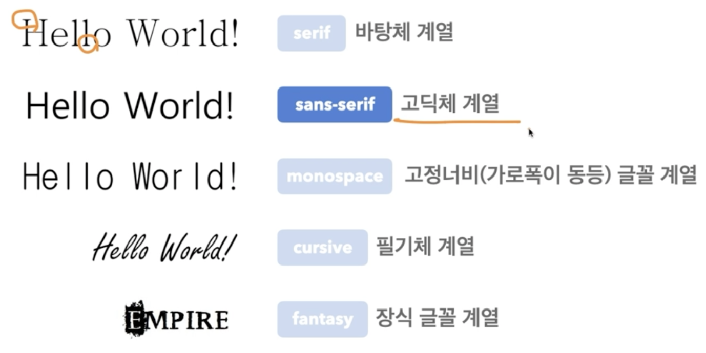
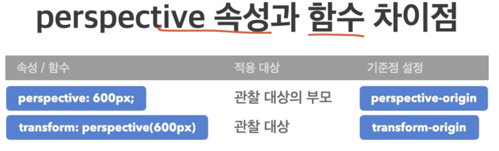
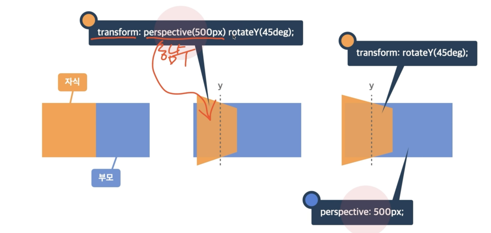
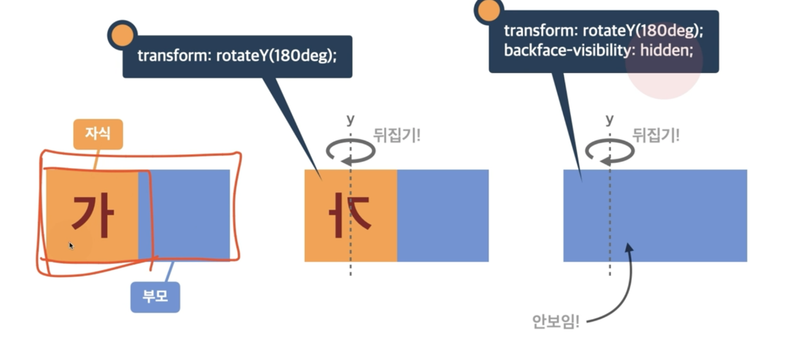

# 너비

width, height : 요소의 가로/세로 너비 (기본값 auto 브라우저가 너비를 계산 , px, em, vw등 단위로 지정)<br/>
max-width, max-height : 요소가 커질 수 있는 최대 다로/세로 너비 ( none 최대 너비 제한 없음 )<br/>
min-width, min-height : 요소가 작아질 수 있는 최소 가로/세로 너비 ( 0 최소 너비 제한 없음 )<br/>

# 단위

px: 픽셀<br/>
% : 상대적 백분율<br/>
em : 요소의 글꼴 크기 1em=폰트사이즈(기본 16px)<br/>
rem : 루트 요소(html)의 글꼴 크기<br/>
vw : 뷰포트 가로 너비의 백분율<br/>
vh : 뷰포트 세로 너비의 백분율<br/>

# 외부 여백(margin)

margin :요소의 외부 여백(공간)을 지정하는 단축 속성 ( 0 외부여백없음, auto 브라우저가 여백을 계산, 단위 px, em, vw 들 단위로 지정 )<br/>
margin-top, bottom, left, right 사용가능<br/>
margin: 10px 20px; : 이렇게 중간에 띄어쓰기를 하면 앞에 10px은 top,bottom이 되고 20px은 left,right가 된다 <br/>
margin: 10px 20px 30px; : top left, right bottom<br/>
margin: 10px 20px 30px 40px; : top right bottom left<br/>

# 내부여백(padding)

padding : 요소의 내부 여백(공간)을 지정하는 단축 속성 ( 0 내부 여백 없음, 단위 px, em, vw 등 단위로 지정, % 부모요소의 가로 너비에 대한 비율로 지정 )<br/>
padding-top, bottom, left, right 사용가능<br/>
padding: 10px 20px; : 이렇게 중간에 띄어쓰기를 하면 앞에 10px은 top,bottom이 되고 20px은 left,right가 된다 <br/>
padding: 10px 20px 30px; : top left, right bottom<br/>
padding: 10px 20px 30px 40px; : top right bottom left<br/>

# 테두리 선

border : 선-두께(border-width) 선-종류(border-style) 선-색상(border-color);<br/>
border-width : 요소 테두리 선의 두께 (단위 : px, em, % 등 단위로 지정)<br/>
border-style : 요소 테두리 선의 종류 ( none 선 없음, solid 실선(일반선), dashed : 파선<br/>
border-color : 요소 테두리 선의 색상을 지정하는 단축 속성 ( black 검정색, 색상 선의 색상, transparent 투명 )<br/>

# 색상 표현

색상 이름 : 브라우저에서 제공하는 색상 이름 ex:) red, blue, black …)<br/>
Hex 색상코드 : 16진수 색상(Hexadecimal Color) ex:) #0000, #FFFFFF<br/>
RGB : 빛의 삼원색 ex:) reb(255, 255, 255)<br/>
RGBA : 빝의 삼원색 + 투명도 ex:) raba(0, 0, 0, 0.5)

```html
border: 4px solid black; : 4px(border-width) solid(border-style)
black(border-color) border-width: top, right, bottom, left; border-width:
top,bottom left right,; border-width: top, left right, bottom, left;
border-width: top right bottom left; border-top: 두께 종류 색상;
border-top-width: 두께; border-top-style: 종류; border-top-color: 색상;
border-radius : 요서의 모서리를 둥글게 깎음 ( 0 둥글게 없음, 단위 px, em, vw등
단위로 지정) border-radius: 0 10px 0 0; : 오른쪽위만 깎음
```

# 크기 계산

box-sizing : 요소의 크기 계산 기준을 지정 ( content-box 요소의 내용content)으로 크기 계산, border-box 요소의 내용 + padding + border로 크기 계산 )

# 넘침 제어

overflow : 요소의 크기 이상으로 내용이 넘쳤을 때, 보여짐을 제어하는 단축 속성<br/>
visible : 넘친 내용을 그대로 보여줌<br/>
hidden : 넘친 내용을 잘라냄<br/>
auto : 넘친 내용이 있는 경우네만 잘라내고 스크롤바 생성<br/>
overflow-x,y : 요소의 크기 이상으로 내용이 넘쳤을 때, 보여짐을 제어하는 개별 속성들<br/>

# 출력 특성

display : 요소의 화면 출력(보여짐) 특성<br/>
block : 상자(레이아웃) 요소<br/>
inline : 글자 요소<br/>
inline-block : 글자 + 상자 요소<br/>
flex : 플렉스 박스 ( 1차원 레이아웃 )<br/>
grid : 그리드 ( 2차원 레이아웃 )<br/>
none : 보여짐 특성 없음, 화면에서 사라짐<br/>
기타 : table, table-row, table-cell 등… <br/>

# 투명도

opacity : 요소 투명도<br/>
1 : 불투명<br/>
0~1 : 0부터 1 사이의 소수점 숫자<br/>
0 : 투명<br/>

# 글꼴

font-size : 글자의 크기 ( 16px 기본크기, 단위 px, em, rem 등등 단위로 지정 )<br/>
font-weight : 글자의 두께(가중치) ( normal,400 기본두께, bold,700 두껍게, 100~900 지정가능 )<br/>
font-style : 글자의 기울기 ( normal 기울기 없음, italic 이텔릭체 )<br/>
line-height : 한 줄의 높이, 행간과 유사 ( 숫자 요소의 글꼴 쿠기의 배수로 지정, 단위 px, em, rem, 등의 단위로 지정 )<br/>
font-family: 글꼴1, “글꼴2”, … 글꼴계열;


# 문자

color : 글자의 색상 ( rgb(0,0,0) 검정색, 색상 기타 지정 가능한 색상 )<br/>
text-align : 문자의 정렬 방식 ( left 왼쪽 정렬, right 오른쪽 정렬, center 가운데 정렬 )<br/>
text-decoration : 문자의 장식(선) ( none 장식 없음, underline 밑줄, line-through 중앙 선 )<br/>
text-indent : 문자 첫 줄의 들여쓰기 ( 0 들여쓰기 없음, 단위 px, em, rem 등 단위로 지정 )<br/>

# 배경

background-color : 요소의 배경 색상 ( transparent 투명함, 색상 지정 가능한 색상 )<br/>
background-image : 요소의 배경 이미지 삽입 ( none 이미지 없음, url(“경로”) 이미지 경로 )<br/>
background-repeat : 요소의 배경 이미지 반복 ( repeat 이미지를 수직, 수평 반복, repeat-x 이미지 수평 반복, repeat-y 이미지 수직 반복, no-repeat 반복 없음 )<br/>
background-position : 요소의 배경 이미지 위치 ( 방향 top, bottom, left, right, center 방향, 단위 px, em, rem 등 단위로 지정 )<br/>
background-size : 요소의 배경 이미지 크기 ( auto 이미지의 실제 크기, 단위 px, em, rem 등 단위로 지정, cover 비율은 유지, 요소의 더 넓은 너비에 맞춤, contain 비율은 유지, 요소의 더 짧은 너비에 맞춤 )<br/>
background-attachment : 요소의 배경 이미지 스크롤 특성 ( scroll 이미지가 요소를 따라서 같이 스크롤, fixed 이미지가 뷰포트에 고정, 스크롤x )<br/>

# 배치

### position : 요소의 위치 지정 기준<br/>

1. static 기준 없음<br/>
2. relative 요소 자신을 기준<br/>
3. absolute 위치 상 부모 요소를 기준<br/>
4. fixed 뷰포트(브라우저)를 기준<br/>
   <br/>
   요소 쌓임 순서(Stack order) : 어떤 요소가 사용자와 더 가깝게 있는지(위에 쌓이는지) 결정<br/>
5. 요소에 position 속성의 값이 있는 경우 위에 쌓임 ( 기본값 static 제외)<br/>
6. 1번 조건이 같은 경유, z-index 속성의 숫자 값이 높을 수록 위에 쌓임<br/>
7. 1번과 2번 조건까지 같은 경우, HTML의 다음 구조일 수록 위에 쌓임<br/>

z-index : 요소의 쌓임 정도를 지정 ( auto 부모 요소와 동일한 쌓임 정도, 숫자 숫자가 높을 수록 위에 쌓임 )<br/>

# 플랙스(정렬)

display : Flex Container의 화면 출력(보여짐) 특성 ( flex 블록 요소와 같이 Flex Container 정의, inline-flex 인라인 요소와 같이 Flex Container 정의 )<br/>
flex-direction : 주 축을 설정 ( row 행 축(좌->우), row-reverse 행 축(우->좌) )<br/>
flex-wrap : Flex Items 묶음(줄 바꿈) 여부 ( no wrap 묶음(줄 바꿈) 없음, wrap 여러 줄로 묶음 )<br/>

## justify-content : 주 축의 정렬 방법

1. flex-start : Flex Items를 시작점으로 정렬<br/>
2. flex-end : Flex Items를 끝점으로 정렬<br/>
3. center : Flex Items를 가운데 정렬<br/>

## align-content : 교차 축의 여러 줄 정렬 방법

1. stretch : Flex Items를 시작점으로 정렬<br/>
2. flex-start : Flex Items를 시작점으로 정렬<br/>
3. flex-end : Flex Items를 끝점으로 정렬<br/>
4. center : Flex Items를 가운데 정렬<br/>

## align-items : 교차 축의 한 줄 정렬 방법

1. stretch : Flex Items를 교차 축으로 늘림<br/>
2. flex-start : Flex Items를 각 줄의 시작점으로 정렬<br/>
3. flex-end : Flex Items를 각 줄의 끝점으로 정렬<br/>
4. center : Flex Items를 각 줄의 가운데 정렬<br/>
   <br/>
   order : Flex Item의 순서 ( 0 순서 없음, 숫자 숫자가 작을 수록 먼저 )<br/>
   flex-grow : Flex Item의 증가 너비 비율 ( 0 증가 비율 없음, 숫자 증가 비율 )<br/>
   flex-shrink : Flex Item의 감소 너비 비율 ( 1 Flex Container 너비에 따라 감소 비율 적용, 숫자 감소 비율 )<br/>
   flex-basis : Flex Item의 공간 배분 점 기본 너비 ( auto 요소의 Content 너비, 단위 px, em, rem 등 단위로 지정 )<br/>

# 전환

transition : 속성명 지속시간 타이밍함수 대기시간; (요소의 전환(시작과 끝) 효과를 지정하는 단축 속성)<br/>
transition-property transition-duration transition-timing-function transition-delay <br/>

transition-property : 전환 효과를 사용할 속성 이름을 지정 ( all 모든 속성에 적용, 속성이름 전환 효과를 사용할 속성 이름 명시 )<br/>
transition-duration : 전환 효과의 지속시간을 지정 ( 0s 전환 효과 없음, 시간 지속시간(s)을 지정)<br/>
transition-timing-function : 전환 효과의 타이밍(Easing) 함수를 지정<br/>

1. ease : 느리게 - 빠르게 - 느리게<br/>
2. linear : 일정하게 <br/>
3. ease-in : 느리게 - 빠르게<br/>
4. ease-out : 빠르게 - 느리게<br/>
5. ease-in-out : 느리게 - 빠르게 - 느리게<br/>
   transition-delay : 전환 효과가 몇 초 뒤에 시작할지 대기시간을 지정 ( 0s 대기시간 없음, 시간 대기시간(s)을 지정 )<br/>

# 변환

## 요소의 변환 효과

1. transform: 변환함수1 변환함수2 변환함수3<br/>
2. transform: 원근법 이동 크기 화전 기울임; <br/>

## 2D 변환 함수

transform(x, y) : 이동(x축, y축)<br/>
transformX : 이동(x축)<br/>
transformY : 이동(y축)<br/>
scale(x ,y) : 크기(x축, y축)<br/>
rotate(degree) : 회전(각도)<br/>
skewX : 기울임(x축)<br/>
skewY : 기울임(y축)<br/>

## 3D 변환 함수

rotateX(x) : 회전(x축)<br/>
rotateY(y) : 회전(y축)<br/>
perspective : 원근법(거리)<br/>

perspective : 하위 요소를 관찰하는 원근 거리를 지정<br/>



backface-visibility : 3D 변환으로 회전된 요소의 뒷면 숨김 여부 ( visible 뒷면 보임, hidden 뒷면 숨김 )

