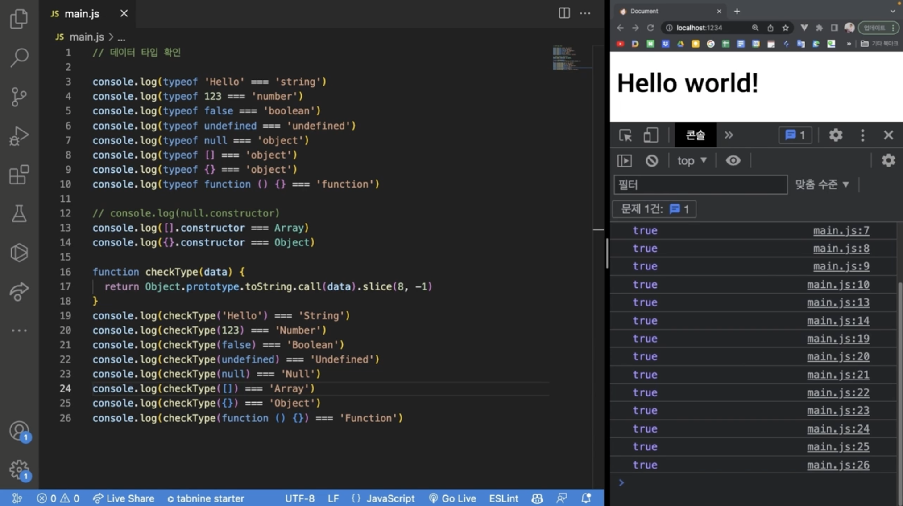

# String

문자형은 “” ‘’ 로 작성가능 ``로도 작성이 가능한데 보관개념으로 사용가능

```javascript
const string1 = “Hello”
const string2 = ‘World’
const string3 = `My ${string1} ?!`  — 템플릿 리터럴

console.lig(string3)

My Hello ?!  출력
```

# Numder

```javascript
const number = 123
console.log(number + 1)
124 출력

const number = -123
console.log(number + 1)
-122 출력

const number = 123.1234
const pi = .14
console.log(number + 1)
console.log(pi)
-122.1234
0.14 출력

const number = 123.1234
const pi = .14
console.log(number + undefined)
console.log(pi)
NaN (not a number = 넘버가 아니다)
0.14 출력

const number = 123.1234
const pi = .14
console.log(typeof (number + undefined))
console.log(typeof pi)
number
number 출력
const a = 0.1
const b = 0.2
console.log(a + b)
0.3000000000004 이런식으로 출력

const a = 0.1
const b = 0.2
console.log((a + b).toFixed(1))
0.3 출력
toFixed를 쓰면 문자열로 출력이된다

const a = 0.1
const b = 0.2
console.log(Number(a + b).toFixed(1))
0.3 숫자열로 출력
```

# 원시형 Boolean, null, undefined

```javascript
Boolean
const a = true
const b = false

if (a) {
	console.log(“aa”)
} else if (b) {
	console.log(“bb)
}
null
let age = null 명시적

undefines
let age = nudrfined 암시적
```

# 참조형 Array

```javascript
const fruits = new Array(‘Apple’, ‘Banana’, ‘Cherry’)
const fruits = [‘Apple’, ‘Banana’, ‘Cherry’]

console.log(fruits.length) 배열에 몇개들어가있는지 물어는거임 3게
console.log(fruits.length - 1) 마지막 배열

참조형 Object

const user = new Object()
user.name = “jo”
user.age = 29

function User() {
	this.name = “Jo”
	this.age = 29
}

const user = {
	name: ‘Jo’
	age: 29
}


const userA = {
	name = ‘Jo’
	age = 29
}

const userB = {
	name = ‘aa’
	age = 22
	parent: userA}


const users = [userA, userB]
```

# 참조형 Function

```javascript
function hello() {
	const.log(‘Hello!’)
}

const a = function () {
	console.log(‘A’)
}
const b = function (c) {
	console.log(c)
}
b(a) a함수출력
```

# 형 변환(Type Conversion)

```javascript
const a = 1
const b = ‘1’

console.log(a === b) flase
console.log(a == b) true
```

=== 일치 권장<br/>
== 동등

# 참과 거짓 ( Truthy & Falsy)

```javascript
if (true) {
	console.log(‘참!’)
}
```

데이터부분에 들어가면 거짓인거<br/>
대부분은 참이다<br/>
false<br/>
0<br/>
null<br/>
nudefined<br/>
NaN<br/>
‘’<br/>
0n<br/>
거짓<br/>
<br/>
데이터 타입 확인 하기

