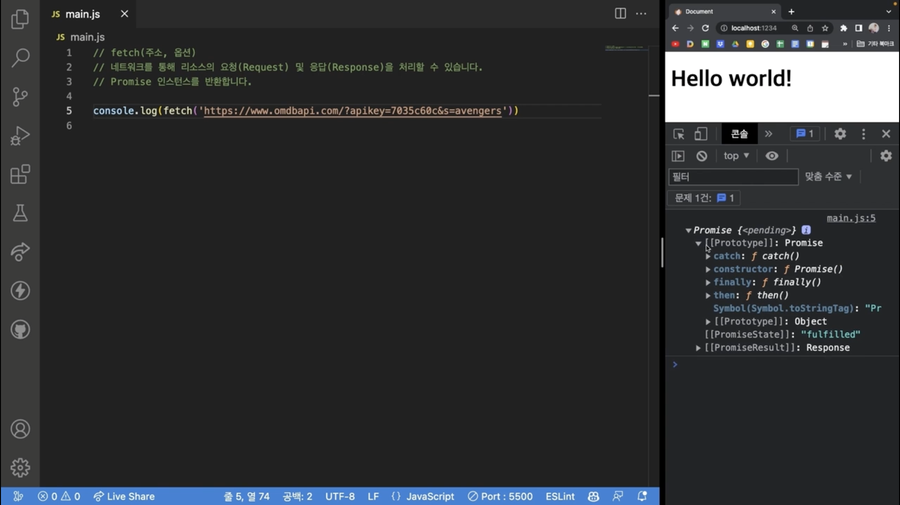

# 비동기

### 동기(Synchronous)와 비동기(Asynchronous)

### 동기: 순차적으로 코드 실행 O

### 비동기 : 순차적으로 코드 실핼 X

## 콜백(Callback) 패턴

```javascript
const a = () => {
  setTimout(() => {
    console.log(1);
  }, 1000);
};
const b = () => console.log(2);

a();
b();
// 2가 먼저 출력 되고 1초후에 1이 출력되는 비동기 코드
```

```javascript
const a = (callback) => {
  setTimout(() => {
    console.log(1);
    callback();
  }, 1000);
};
const b = () => console.log(2);

a(() => {
  b();
});
// 이렇게 하면 1과2가 1초후에 1,2순서대로 출력된다
```

```javascript
const a = (callback) => {
  setTimout(() => {
    console.log(1);
    callback();
  }, 1000);
};
const b = (callback) => {
  setTimout(() => {
    console.log(2);
    callback();
  }, 1000);
};
const c = (callback) => {
  setTimout(() => {
    console.log(3);
    callback();
  }, 1000);
};
const d = () => console.log(4);
a(() => {
  b(() => {
    c(() => {
      d();
    });
  });
});
// 이렇게 하면 1초후에 1 또1초뒤에 2 또1초뒤에 3,4순서대로 출력된다
// 콜백지옥
```

## Promise

```javascript
const a = (callback) => {
  setTimout(() => {
    console.log(1);
    callback();
  }, 1000);
};
const b = () => console.log(2);

a(() => {
  b();
});
```

이 코드를

```javascript
const a = () => {
  return new Promise((resolve) => {
    setTimout(() => {
      console.log(1);
      resolve();
    }, 1000);
  });
};
const b = () => console.log(2);

a().then(() => {
  b();
});
```

이렇게 사용가능<br/>
<br/>
결과적으로

```javascript
const a = () => {
  return new Promise((resolve) => {
    setTimout(() => {
      console.log(1);
      callback();
    }, 1000);
  });
};
const b = () => {
  return new Promise((resolve) => {
    setTimout(() => {
      console.log(2);
      resolve();
    }, 1000);
  });
};
const c = () => {
  return new Promise((resolve) => {
    setTimout(() => {
      console.log(3);
      resolve();
    }, 1000);
  });
};
const d = () => console.log(4);

a()
  .then(() => {
    return b();
  })
  .then(() => {
    return c();
  })
  .then(() => {
    d();
  });

a()
  .then(() => b())
  .then(() => c())
  .then(() => b());

a()
  .then(b)
  .then(c)
  .then(d)
  .then(() => console.log('done'));
```

`.then`을 계속 붙여서 사용가능

##### promise 예제

```javascript
const getMovies = (movieName) => {
  return new Promise((resolve) => {
    fetch('https://www.omdbapi.com/?apikey=7035c60c&s=${movieName}')
      .then((res) => res.json())
      .then((res) => {
        console.log(res);
        resolve();
      });
  });
};

getMovies('frozen')
  .then(() => {
    console.log('겨울왕국');
    return getMovies('avengers');
  })
  .then(() => {
    console.log('어벤져스');
    return getMovies('avatar');
  })
  .then(() => {
    console.log('아바타');
  });
```

## Async Await패턴

```javascript
const a = () => {
  return new Promise((resolve) => {
    setTimout(() => {
      console.log(1);
      resolve();
    }, 1000);
  });
};
const b = () => console.log(2);

a().then(() => {
  b();
});
```

`a().then(() => { b() })` 이 부분을

```javascript
await a();
b();
```

이렇게 사용할수 있지만 `await`는 함수에 씌어져 있어야 사용가능

```javascript
const wrap = async () => {
  await a();
  b();
};
```

이렇게 사용할수있다

```javascript
const getMovies = (movieName) => {
  return new Promise((resolve) => {
    fetch('https://www.omdbapi.com/?apikey=7035c60c&s=${movieName}')
      .then((res) => res.json())
      .then((res) => {
        console.log(res);
        resolve();
      });
  });
};

getMovies('frozen')
  .then(() => {
    console.log('겨울왕국');
    return getMovies('avengers');
  })
  .then(() => {
    console.log('어벤져스');
    return getMovies('avatar');
  })
  .then(() => {
    console.log('아바타');
  });
```

고쳐보자

```javascript
const wrap = asvnc () => {
  await getMovies('frozen')
  console.log('겨울왕국')
  await getMovies('avengers')
  console.log('어벤져스')
  await getMovies('avatar')
  console.log('아바타')
}
wrap()
```

완성!

## Resolve, Reject 그리고 에러 핸들링

```javascript
const delayAdd = (index, cd, errorCb) => {
  setTimeout(() => {
    if (index > 10) {
      errorCb(`${index}는 10보다 클 수 없습니다.`)
      return
    }
    console.log(index)  출력 : 4
    cb(index +1)
  }, 1000)
}

delayAdd(
  4,
  res => console.log(res),  출력 : 5
  err => console.logerror(err)
)
```

##### Promisse 클래스로 만들기

```javascript
const delayAdd = index => {
  return new Promise((resolve, reject) => {
    setTimeout(() => {
    if (index > 10) {
      reject(`${index}는 10보다 클 수 없습니다.`) 출력 : 13는 10보다 클 수 없습니다.
      return
    }
    console.log(index)
    cb(index +1)
    }, 1000)
  })
}

delayAdd(13)
  .then(res => console.log(res))
  .then(err => console.log(err))
  //.catch(err => console.log(err))
  .finally(() => console.log('끝'))   then과 catch메소드의 실행과 상관없이 finally 부분에  callback은 항상 실행이 될 수 있는 구조

async await 패턴의 코드로 만들기
const wrap = async () => {
  const res = await delayAdd(2)
  console.log(res)
}
wrap()

catch라는 메소가 하는 역활을 async await 패턴으로 작성
try {
  const res = await delayAdd(2)
  console.log(res)
} catch (err) {
  console.log(err)
} .finally {
  console.log('끝')
}
wrap()
```

새로운 예제

```javascript
const getMovies = (movieName) => {
  return new Promise((resolve) => {
    fetch('https://www.omdbapi.com/?apikey=7035c60c&s=${movieName}')
      .then((res) => res.json())
      .then((res) => {
        if (json.Response === 'False') {
          reject(json.Error);
        }
        resolve(json);
      })
      .catch((error) => {
        reject(error);
      });
  });
};

let loading = true;

// .then
getMovies('avengers')
  .then((movies) => console.log('영화 목록:', movies))
  .catch((error) => console.log('에러 발생:', error))
  .finally(() => (loading = false));

// async await
const wrap = async () => {
  const movies = await getMovies('avengers');
  console.log('영화 목록:', movies);
};

// try catch
const wrap = async () => {
  try {
    const movies = await getMovies('avengers');
    console.log('영화 목록:', movies);
  } catch (error) {
    console.log('에러 발생:', error);
  } finally {
    loading = false;
  }
};
```

## 반복문에서 비동기 처리

```javascript
const getMovies = (movieName) => {
  return new Promise((resolve) => {
    fetch('https://www.omdbapi.com/?apikey=7035c60c&s=${movieName}')
      .then((res) => res.json())
      .then((res) => resolve(res));
  });
};
const titles = ['frozen', 'avengers', 'avatar'];

// titles.forEach(async title => {
//   const movies = await getMovies(title)
//   console.log(title, movies)
// })

const wrap = async () => {
  for (const title of titles) {
    const movies = await getMovies(title);
    console.log(title, movies);
  }
};
wrap();
```

## fetch()

`fetch()`는 네트워크를 통해 리소스의 요청(Request) 및 응단(Response)을 처리할 수 있습니다.<br/>
Promise 인스턴스를 반환합니다.


```javascript
fetch('https://www.omdbapi.com/?apikey=7035c60c&s=avengers')
  .then((res) => {
    return res.json();
  })
  .then((json) => console.log(json));

const wrap = async () => {
  const res = await fetch(
    'https://www.omdbapi.com/?apikey=7035c60c&s=avengers'
  );
  const json = await res.json();
  console.log(json);
};
wrap();
```

fetch에서 쓸수있는 몇가지 메소드 예제

```javascript
fetch('https://www.omdbapi.com/?apikey=7035c60c&s=avengers'), {
  method: 'GET',
  headers: {
    'Content-Type': 'application/json'
  },
  body: JSON.stringify({
    name: 'Jo',
    age: 29
    email: 'swcc321@naver.com'
  })
}
```
