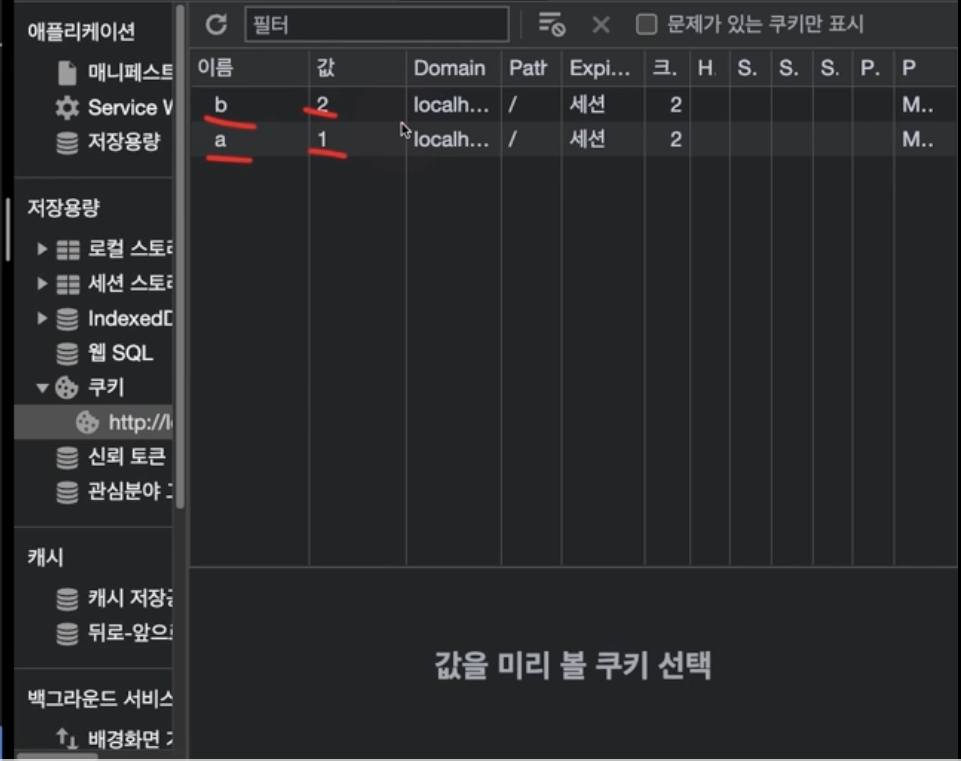

# Cookie(쿠키)

### 도메인 단위로 저장

### 표준안 기준, 사이트당 최대 20개 및 4KB로 제한

### 영구 저장 불가능

<br/>

### domain : 유효 도메인 설정

### path : 유효 경로 설정

### expires : 만료 날짜(UTC Date)설정

### max-age : 만료 타이머(s) 설정

```javascript
document.cookie = 'a=1; domain=localhost; path=/abc';
document.cookie = 'b=2; max-age=3';
document.cookie = `c=3; max-age=${60 * 60 * 24}`;
document.cookie = `d=4; expires=${new Date(2025, 11, 16).toUTCString()}`;
console.log(document.cookie);

function getCookie(name) {
  const cookie = document.cookie
    .split('; ')
    .find((cookie) => cookie.split('=')[0] === name);
  return cookie ? cookie.split('=')[1] : null;
}

console.log(getCookie('a'));
```



# Storage(스토리지)

### 도메인 단위로 저장

### 5MB 제한

### 세션 혹은 영구 저장 가능

<br/>

### sessionStorage : 브라우저 세션이 유지되는 동안에만 데이터 저장

### localStorage : 따로 제거하지 않으면 영구적으로 데이터 저장

<br/>

### .getItem() : 데이터 조회

### .setItem() : 데이터 추가

### .removeItem() : 데이터 제거

### .clear() : 스토리지 초기화

localStorage

```javascript
localStorage.setItem('a', 'Hello world')
localStorage.setItem('a', JSON.stringify('Hello world'))
localStorage.setItem('b', { x: 1, y: 2 })
localStorage.setItem('b', JSON.stringify{ x: 1, y: 2 })
localStorage.setItem('c', 123)
localStorage.setItem('c', JSON.stringify(123))

console.log(localStorage.getItem('a'))
console.log(JSON.parse(localStorage.getItem('a')))
console.log(localStorage.getItem('b'))
console.log(JSON.parse(localStorage.getItem('b')))
console.log(localStorage.getItem('c'))
console.log(JSON.parse(localStorage.getItem('c')))

localStorage.removeItem('a')
localStorage.clear()
```

sessionStorage

```javascript
sessionStorage.setItem('a', 'Hello world')
sessionStorage.setItem('a', JSON.stringify('Hello world'))
sessionStorage.setItem('b', { x: 1, y: 2 })
sessionStorage.setItem('b', JSON.stringify{ x: 1, y: 2 })
sessionStorage.setItem('c', 123)
sessionStorage.setItem('c', JSON.stringify(123))

console.log(sessionStorage.getItem('a'))
console.log(JSON.parse(sessionStorage.getItem('a')))
console.log(sessionStorage.getItem('b'))
console.log(JSON.parse(sessionStorage.getItem('b')))
console.log(sessionStorage.getItem('c'))
console.log(JSON.parse(sessionStorage.getItem('c')))

sessionStorage.removeItem('a')
sessionStorage.clear()
```
