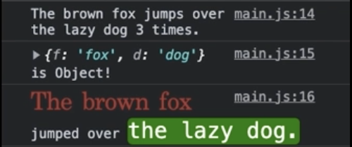

# console

## 콘솔에 메시지나 객체를 출력합니다.

### log: 일반 메지지

### warn: 경고 메세지

### error: 에러 메시지

### dir: 속성을 볼 수 있는 객체를 출력

```javascript
console.log();
console.warn();
console.error();
console.dir();
```

## 콘솔에 메소드 호출의 누적 횟수를 출력하거나 초기화합니다.

### console.count('이름')

### console.countReset('이름')

```javascript
console.count('a')        출력 : a: 1
console.count('a')        출력 : a: 2
console.count('b')        출력 : b: 1
console.count('a')        출력 : a: 3
console.countReset('a')
console.count('a')        출력 : a: 1
console.count('b')        출력 : b: 1
```

## 콘솔에 타이머가 시작해서 종료되기까지의 시간(ms)을 출력합니다

### console.time('이름')

### console.timeEnd('이름')

```javascript
console.time('반복문');

for (let i = 0; i < 10000; i += 1) {
  console.log(i);
}
console.timeEnd('반복문');
```

## 메소드 호출 스택(Call Stack)을 추척해 출력합니다.

```javascript
function a() {
  function b() {
    function c() {
      console.log('Log');
      console.log('Trace');
    }
    c();
  }
  b();
}
a();
```

## 콘솔에 기록된 메기지를 모두 삭제랍니다.

### console.clear()

```javascript
console.log();
console.warn();
console.error();
console.dir();
console.clear();
```

## 서식 문자 치환

### %s 문자로 적용

### %o 객체로 적용

### %c CSS를 적용

```javascript
const a = 'The brown fox';
const b = 3;
const c = {
  f: 'fox',
  d: 'dog',
};
console.log('%s jumps over the lazy dog %s times.', a, b);
console.log('%o is Object', c);
console.log(
  '%cThe brown fox %cjumped over %cthe lazy dog.',
  'color: brown; font-family: serif; font-size: 20px;',
  '',
  'font-size: 18px; color: #FFF; background-color: green; border-radius: 4px;'
);
```


