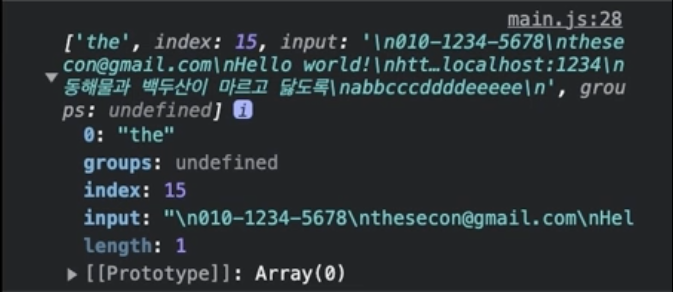

# 정규 표현식(RegExp, Regular Expression)

### 문자 검색(Search)

### 문자 대체(Replace)

### 문자 추출(Extract)

## 생성자

### new RegExp('표현', '옵션')

### new RegExp('[a-z]', 'gi')

## 리터럴

### /표현/옵션

### /[a-z]/gi

```javascript
const str = `
010-1234-5678
swcc321@naver.com
Hello World
https://www.naver.com
The quick brown fox jumps over the lazy dog.
hello@naver.com
https://localhost:1234
동해물과 백두산이 마르고 닳도록
abbcccddddeeeee
`;

const regexp = new RegExp('the', '');
console.log(str.match(regexp));
```



```javascript
const regexp = new RegExp('the', 'g')
console.log(str.match(regexp))    출력 : ['the', 'the']
```

```javascript
const regexp = new RegExp('the', 'gi')
console.log(str.match(regexp))    출력 : ['the', 'The', 'the']
```

### 리터럴 방식

```javascript
const regexp = /the/gi
console.log(str.match(regexp))    출력 : ['the', 'The', 'the']

console.log(str.match(/the/gi))    출력 : ['the', 'The', 'the']
```
