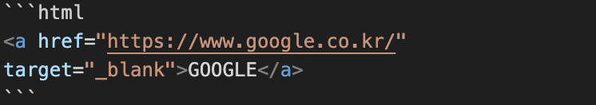
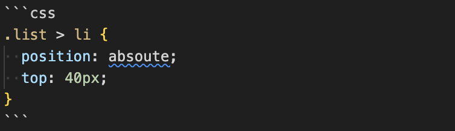
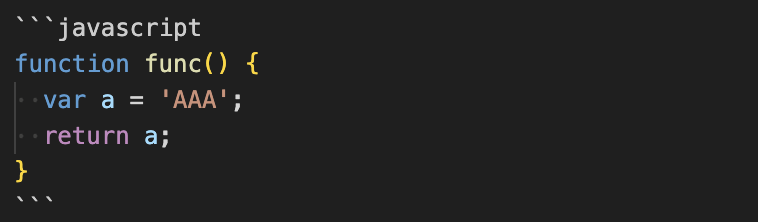
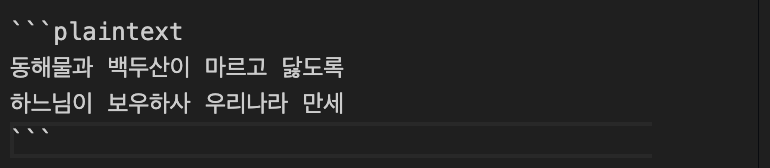

# README.md

# 제목(Header)

```html
# 제목(Header)
```

## 제목2

```html
## 제목2
```

### 제목3

```html
### 제목3
```

#### 제목4

```html
#### 제목4
```

##### 제목5

```html
##### 제목
```

###### 제목6

```html
###### 제목6
```

# 줄바꿈

```html
안녕하세요<br />
메모장 입니다
```

안녕하세요<br/>
메모장입니다

# 원시 HTML(Raw HTML)

```html
동해물과 <span style="text-decoration: underline;">백두산이</span> 마르고
닳도록<br />
하느님이 보우하사 우리나라 만세
```

동해물과 <span style="text-decoration: underline;">백두산이</span> 마르고 닳도록<br/> 하느님이 보우하사 우리나라 만세

# 수평선

```html
---<br />
***<br />
___
```

---

---

---

# 인용문(BlockQuote)

```html
> 남의 말이나 글에서 직접 또는 간접으로 따온 문장.<br />
> (네이버 국어 사전)
```

> 남의 말이나 글에서 직접 또는 간접으로 따온 문장.<br/>
> (네이버 국어 사전)

```html
> 인용문을 작성하세요!<br />
>> 중첩된 인용문<br />
>>> 중중첩된 인용문1<br />
>>>> 중중첩된 인용문2<br />
>>>>> 중중첩된 인용문3
```

> 인용문을 작성하세요!
>
> > 중첩된 인용문
> >
> > > 중중첩된 인용문1
> > >
> > > > 중중첩된 인용문2
> > > >
> > > > > 중중첩된 인용문3

# 인라인(inline) 코드 강조

```html
CSS에서 'Background' 혹은 'background-image' 속성으로 요소에 배경 이미지를
삽입할 수 있습니다.
```

CSS에서 'Background' 혹은 'background-image' 속성으로
요소에 배경 이미지를 삽입할 수 있습니다.

# 블록(block) 코드 강조

## html

```html
<a href="https://www.naver.com" target="_blank">Naver</a>
```



## css

```css
.list > li {
  position: absoute;
  top: 40px;
}
```



## javascript

```javascript
function func() {
  var a = 'AAA';
  return a;
}
```



## bash

```bash
$ git commit -m 'Study MarkDown'
```


## plaintext

```plaintext
동해물과 백두산이 마르고 닳도록 하느님이
보우하사 우리나라 만세
```



# 링크

```html
<a href=https://naver.com>NAVER</a>
```

<a href=https://naver.com>NAVER</a>

```html
[NAVER](https://naver.com)
```

[NAVER](https://naver.com)

```html
<a href="https://naver.com" title="NAVER로 이동!">NAVER</a>
```

<a href="https://naver.com" title="NAVER로 이동!">NAVER</a>

```html
[NAVER](https://naver.com "NAVER로 이동!")
```

[NAVER](https://naver.com 'NAVER로 이동!')

```html
<a href="https://naver.com" title="NAVER로 이동!" target="_blank">NAVER</a>
```

<a href="https://naver.com" title="NAVER로 이동!" target="_blank">NAVER</a>

# 이미지

```html

```

```html

```


```html
</img>
```

</img>

# 강조(Emphasis)

_이텔릭_

```html
_이텔릭_
```

**두껍게**

```html
**두껍게**
```

**_이텔릭_ + 두껍게**

```html
**_이텔릭_ + 두껍게**
```

~~최소선~~

```html
~~최소선~~
```

<u>밑줄</u>

```html
<u>밑줄</u>
```

# 목록(List)

1. 순서가 필요한 목록
1. 순서가 필요한 목록
1. 순서가 필요한 목록
   1. 순서가 필요한 목록
   1. 순서가 필요한 목록
1. 순서가 필요한 목록

- 순서가 필요한 목록
- 순서가 필요한 목록
- 순서가 필요한 목록
  - 순서가 필요한 목록
  - 순서가 필요한 목록
- 순서가 필요한 목록

```html
1. 순서가 필요한 목록<br />
1. 순서가 필요한 목록<br />
1. 순서가 필요한 목록<br />
1. 순서가 필요한 목록<br />
1. 순서가 필요한 목록<br />
1. 순서가 필요한 목록<br />
<br />
- 순서가 필요한 목록<br />
- 순서가 필요한 목록<br />
- 순서가 필요한 목록<br />
- 순서가 필요한 목록<br />
- 순서가 필요한 목록<br />
- 순서가 필요한 목록<br />
```

# 표(Table)

position 속성

| 값       |       의미        | 기본값 |
| -------- | :---------------: | -----: |
| static   |     기준 없음     |      O |
| relative |     요소 자신     |      X |
| absolute | 위치 상 부모 요소 |      X |
| fixed    |      뷰포트       |      X |

```html
값 | 의미 | 기본값 --|:--:|--: static | 기준 없음 | O relative | 요소 자신 | X
absolute | 위치 상 부모 요소 | X fixed | 뷰포트 | X
```
